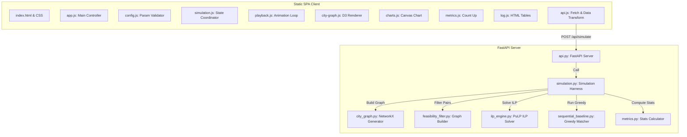
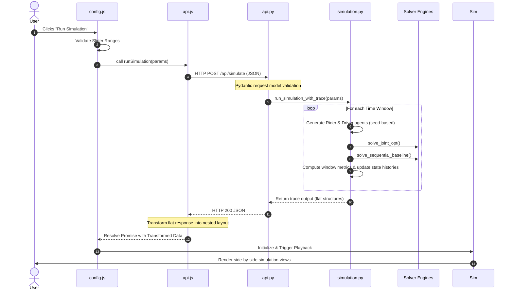

# System Architecture Guide: Oober (R3)

This document provides a detailed overview of the system architecture, design decisions, component layouts, and data flows of Oober—a ride-hailing optimization research dashboard.

---

## 1. Executive Overview

Oober is a research platform designed to evaluate and compare two ride-hailing match-and-pricing methodologies:
1. **JointOpt (ILP-based)**: Formulates assignment and pricing simultaneously as an Integer Linear Program (ILP) using PuLP. It aims to minimize total wait times while satisfying price stability ($\delta$) and driver earnings fairness constraints.
2. **SeqBaseline (Greedy)**: A sequential baseline representing standard industry practice—first estimating a surge price for each corridor based on greedy supply-demand ratios, and then matching available drivers to riders who can afford the surge.

The platform provides a interactive, glassmorphism-styled web interface where researchers can adjust parameters (time windows, price stability, fairness tolerance, city size/zones, and random seed) and watch real-time simulation playbacks, agents spawning/routing on a city graph, and progressive performance charts.

---

## 2. Architectural Principles

- **Separation of Concerns**: The backend is a pure optimization engine and REST API. The frontend is a single-page visualization application. Communication is strictly over HTTP JSON contracts.
- **RNG Reproducibility**: High-fidelity scientific simulation requires exact repeatability. Every simulation run derives deterministic pseudorandom paths from a single master seed.
- **Decoupled System State**: JointOpt and SeqBaseline maintain separate pricing memories and driver earnings histories during a run to ensure no cross-contamination of evaluation results.

---

## 3. System Components & Dependencies

The system is organized into a client-server architecture:

### Backend Components (Python)
1. **`api.py` (FastAPI Server)**: Exposes REST API routes (`POST /api/simulate`, `GET /api/health`) and serves static frontend client files.
2. **`simulation.py` (Simulation Harness)**: Orchestrates the multi-window simulation loop. Generates synthetic demand, builds feasibility graphs, runs optimization algorithms, computes metrics, and aggregates results.
3. **`city_graph.py` (City Graph)**: Generates a strongly connected directed graph of zones representing the road network using `NetworkX`. Computes shortest-path travel costs using Dijkstra's algorithm.
4. **`feasibility_filter.py` (Feasibility Filter)**: Generates a bipartite graph linking riders and drivers based on travel time feasibility and pricing limits (willingness-to-pay vs. minimum acceptable fare).
5. **`ilp_engine.py` (ILP Engine)**: Translates the bipartite feasibility graph into an Integer Linear Program utilizing `PuLP` and solves it.
6. **`sequential_baseline.py` (Greedy Engine)**: Simulates greedy matches by first calculating surge pricing for zones based on local supply and demand ratios, then greedily matching drivers to riders sorted by willingness-to-pay.
7. **`metrics.py` (Metrics module)**: Computes performance metrics per window (average wait times, earnings variance, price deviation, and matching rates).

### Frontend Components (JavaScript)
- **`app.js`**: Core entry point that bootstraps modules and handles resizing.
- **`config.js`**: Manages user input parameters, synchronization of sliders, validation constraints, and API trigger actions.
- **`api.js`**: Wraps backend API communications and transforms backend response structure (flat objects) to the nested format expected by the UI.
- **`simulation.js`**: The main coordinator that manages view switching, playback event listeners, and data binding for sub-modules.
- **`playback.js`**: Control center for play, pause, stepping, speed adjustment, and synchronized timing loops.
- **`city-graph.js`**: Renders side-by-side D3.js SVGs of the city zones, animating vehicle agents moving and spawning.
- **`charts.js`**: Renders Canvas-based line charts comparing progressive metrics over time windows.
- **`metrics.js`**: Controls the animated count-up numbers in metrics cards.
- **`log.js`**: Controls detailed per-window matching tables for developer audits.

---

## 4. Data Flow & Request Lifecycle

The request-response lifecycle follows this sequence when a simulation is triggered:

---

## 5. Key Design Decisions

- **Client-Side Data Reshaping**: Rather than modifying the core backend code (which must remain constant to prevent breaking established research logs), a transformation layer was introduced in `frontend/js/api.js`. This maps backend flat structures into the nested structures expected by frontend modules.
- **Anime.js Timeline Integration**: Interactive playback is synchronized with D3 graph transitions by wrapping SVG transformations in Anime.js timelines and registering them with `playback.js`.
- **CSV Data Exporter**: Results can be downloaded directly from the client. The exporter parses window metrics on-the-fly and generates a structured CSV without generating load on the backend.

---

## 6. Tradeoffs & Known Limitations

- **ILP Infeasibility (Hard Constraints)**: The current ILP formulation treats price stability and driver fairness as hard constraints. Under extremely strict parameters, the PuLP solver cannot locate an optimal solution and reports `"Infeasible"`, causing the simulator to register zero matches. 
  * *Tradeoff*: Ensures absolute adherence to fairness boundaries at the cost of operational robustness.
- **Browser-Side Rendering Performance**: Side-by-side D3.js graphs and canvas charting are computationally expensive. High window sizes ($>30$) or zone counts ($>20$) can cause rendering jank on lower-end hardware.
- **Static Graph Topology**: The city graph is generated once per simulation. The road networks do not dynamically change weight or link connectivity across windows.
