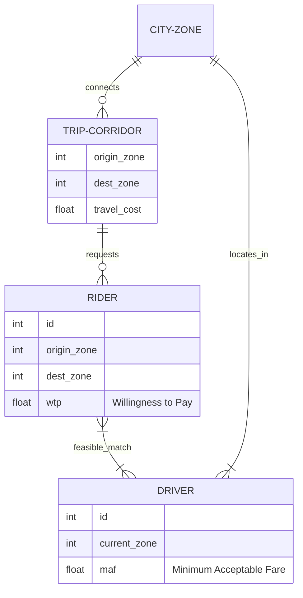

# Developer Workflows and Concepts Guide: Oober (R5)

This guide provides deep technical concepts, onboarding paths, mathematical formulations, debugging practices, and extension points for developers working on the Oober platform.

---

## 1. Zero-to-Hero Learning Path

To get familiar with the codebase:
1. **Explore the Domain Model**: Understand the core relationships between Cities, Zones, Riders, and Drivers (see the ER diagram below).
2. **Review the Solvers**:
   - Open [oober/sequential_baseline.py](file:///D:/Coding%20Projects/College%20Era/Oober/oober/sequential_baseline.py) to see how traditional surge pricing is calculated.
   - Open [oober/ilp_engine.py](file:///D:/Coding%20Projects/College%20Era/Oober/oober/ilp_engine.py) to read the Integer Linear Program formulation.
3. **Trace the Frontend Orchestration**:
   - Check [frontend/js/app.js](file:///D:/Coding%20Projects/College%20Era/Oober/frontend/js/app.js) to see the main bootstrap sequence.
   - Check [frontend/js/simulation.js](file:///D:/Coding%20Projects/College%20Era/Oober/frontend/js/simulation.js) to trace how the simulator binds playback step changes to graph and chart updates.

---

## 2. Core Optimization Concepts

### Domain Model & ER Diagram



### Joint Assignment-and-Pricing ILP (JointOpt)

Unlike sequential pricing systems, `JointOpt` models driver-rider matching and pricing together. 

#### Decision Variables
- $x_{r,d} \in \{0, 1\}$: Binary variable indicating if rider $r$ is matched to driver $d$.
- $p_{r,d} \ge 0$: Continuous variable indicating the price paid by rider $r$ to driver $d$ if matched.

#### Objective
Minimize total matched travel times (wait times):
$$\min \sum_{(r,d) \in E_{feas}} \text{travel\_cost}(r,d) \cdot x_{r,d}$$

#### Key Constraints
1. **Assignment Bounds**:
   - $\sum_{d} x_{r,d} \le 1$ (each rider matched to at most 1 driver)
   - $\sum_{r} x_{r,d} \le 1$ (each driver matched to at most 1 rider)
2. **Feasible Price Range**:
   - $p_{r,d} \ge \text{MAF}_{d} \cdot x_{r,d}$ (driver accepts fare above minimum acceptable fare)
   - $p_{r,d} \le \text{WTP}_{r} \cdot x_{r,d}$ (rider accepts fare below willingness-to-pay)
3. **Price Stability ($\delta$)**:
   For any corridor (origin to destination zone) with a price $P_{prev}$ recorded in the previous window:
   - $p_{r,d} \ge P_{prev} \cdot (1 - \delta) \cdot x_{r,d}$
   - $p_{r,d} \le P_{prev} \cdot (1 + \delta) \cdot x_{r,d}$
4. **Earnings Fairness**:
   Drivers' total earnings are constrained to stay close to the market average midpoint to prevent high driver churn.

---

## 3. Debugging Workflows

### Backend Debugging
- **Run the API server with debug reloads**:
  ```bash
  uvicorn oober.api:app --reload --port 8000
  ```
- **Inspect API Payloads**:
  Use FastAPI's interactive docs at [http://localhost:8000/docs](http://localhost:8000/docs) to trigger manual POST simulation payloads and inspect validation constraints or response schemas.
- **Trace Solver Output**:
  To debug PuLP solver details, you can temporarily set `msg=True` in `model.solve()` inside [oober/ilp_engine.py](file:///D:/Coding%20Projects/College%20Era/Oober/oober/ilp_engine.py) to print the solver matrix and solver logs directly to your terminal.

### Frontend Debugging
- **Browser Developer Tools**:
  Press `F12` (or `Cmd+Option+I` on macOS) and inspect the **Console** tab for JS errors or API network failures.
- **D3 SVG Inspection**:
  Use the **Elements** tab to inspect the SVG DOM elements generated inside `#graph-joint` and `#graph-baseline` to confirm node coordinates, edge lines, and moving agent classes.

---

## 4. Extension Points

If you wish to extend the Oober project, look at these specific files:
- **Adding New Evaluation Metrics**: Add calculations in [oober/metrics.py](file:///D:/Coding%20Projects/College%20Era/Oober/oober/metrics.py) and update the corresponding frontend dashboards in [frontend/js/metrics.js](file:///D:/Coding%20Projects/College%20Era/Oober/frontend/js/metrics.js) and [frontend/js/charts.js](file:///D:/Coding%20Projects/College%20Era/Oober/frontend/js/charts.js).
- **Alternative Solvers**: Customize [oober/ilp_engine.py](file:///D:/Coding%20Projects/College%20Era/Oober/oober/ilp_engine.py) to load alternative MILP solvers (e.g. Gurobi, GLPK, or CPLEX) instead of the default Coin-OR CBC.
- **Dynamic City Graph Layouts**: Refactor [oober/city_graph.py](file:///D:/Coding%20Projects/College%20Era/Oober/oober/city_graph.py) to import real GIS road networks (e.g., OpenStreetMap data via `osmnx`) rather than generating synthetic topologies.
